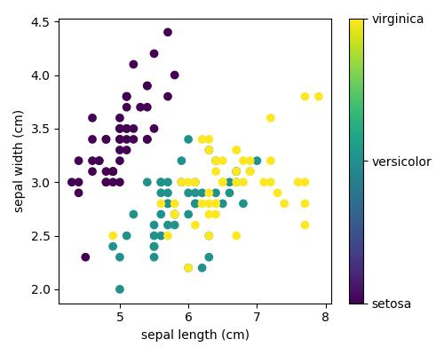

# Novos Talentos

[Programa de novos talentos](https://novostalentosjuntoseguros.gupy.io/)

## Desafio

O teste a seguir tem como objetivo avaliar o seu conhecimento de programação, a conclusão deste teste em sua totalidade não é esperada. O que será avalidado será o quanto você consegue avançar nessas diferentes áreas de atuação.

A linguagem de programação, assim como as ferramentas/frameworks utlizados para a conclusão do teste são de sua livre escolha.

## Questões

1 . Desenvolva utilizando estruturas de repetição, uma função que receba um vetor e um inteiro por parâmetro, e realize um shift no vetor do tamanho do número inteiro recebido.
O tamanho do shift deverá aceitar números negativos também. O sinal do tamanho servirá para definir a direção do shift.

Números positivos indicam o shift da direita para a esquerda.

Números negativos indicam o shift da esquerda para a direita.

```bash
Não serão aceitas respostas do tipo: "return vetor-tamanho: + vetor:-tamanho"
```

2 . Dado o gráfico de dispersão abaixo, descrevendo duas características de três diferentes espécies de plantas, na qual cada cor indica uma espécie diferente. Como você faria para saber qual é a espécie de uma planta com sepal width igual 3.2 e sepal length igual 6.3? Explique seu raciocínio, quanto mais detalhada for a explicação melhor será o nosso entendimento.



## Prática

Desenvolva um sistema de gerenciamento de tarefas, aka TO DO list, deverá ser possível que o usuário realize a criação de uma tarefa, a sua exclusão e marcar como concluída.

Esperamos que seja desenvolvido um serviço de backend utilizando como modelo de comunicaçõa o padrão REST onde será possível realizar as ações de escrita, leitura, atualização e exclusão do registro (CRUD). As tarefas devem pertencer a um usuário.

As tarefas devem ser persistidas em um banco de dados. Os registros de usuário não precisam possuir necessáriamente serviços de CRUD, podendo ser inseridos diretamente no banco de dados.

A interface web deverá apresentar a lista de tarefas pendentes do usuário com a opção de listar também as tarefas já concluídas e a opção de criar novas tarefas.

Você deverá elaborar também os cenários de testes envolvendo a aplicação além de automatizar o processo de deploy dessa plataforma.

## Diferenciais

- Implementar testes unitários;
- As rotas de manipulação de tarefas devem utilizar uma autenticação via web token;
- Utilizar estrutura de "containers";
- Criar o processo de deploy continuo utilizando o conceito de infraestrutura como código;
